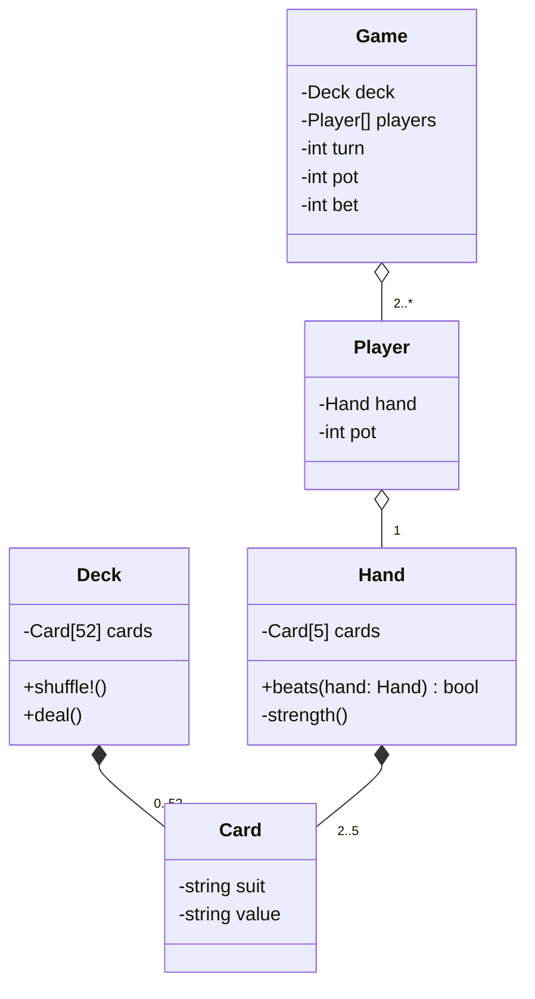

# Five Card Draw Poker Game

## Overview

In this project, you'll apply Object-Oriented Programming (OOP) principles, Test-Driven Development (TDD) methodologies, and work with Git for version control, to implement a Five Card Draw Poker game in Ruby. The project aims to strengthen your understanding of Ruby OOP, RSpec testing, TDD practices, and UML diagramming, through practical application.

## UML Diagram

## Sample Game Run #0 (raise then see, no folds, no discards)

Starting 5 Card Draw Poker Game...

Shuffling deck...

Dealing cards to players...
Player 1's hand: 10♠, J♦, Q♠, K♠, A♠
Player 2's hand: 2♣, 3♣, 9♦, J♣, K♦

Player 1's pot: $500
Player 2's pot: $500
Current main pot: $0

Betting round:
Player 1, your pot: $500
Current main pot: $0
Current bet: $0
Enter your bet (fold, call, or raise): raise 10
Main pot is now $10
Your pot is now $490

Player 2, your pot: $500
Current main pot: $10
Current bet: $10
Enter your bet (fold, call, or raise): call
Main pot is now $20
Your pot is now $490

Player 1's turn:
Your hand: 10♠, J♦, Q♠, K♠, A♠
Choose cards to discard (enter positions separated by spaces, or 'none' to keep all): none

Player 2's turn:
Your hand: 2♣, 3♣, 9♦, J♣, K♦
Choose cards to discard (enter positions separated by spaces, or 'none' to keep all): none

Betting round:
Player 1, your pot: $490
Current main pot: $20
Current bet: $0
Enter your bet (fold, call, or raise): raise 50
Main pot is now $70
Your pot is now $440

Player 2, your pot: $490
Current main pot: $70
Current bet: $50
Enter your bet (fold, call, or raise): call
Main pot is now $120
Your pot is now $440

Final hands:
Player 1: 10♠, J♦, Q♠, K♠, A♠ (Royal Flush)
Player 2: 2♣, 3♣, 9♦, J♣, K♦ (High Card)

Winner is Player 1 with a Royal Flush!
Player 1 wins $120

Game over. Player 1's pot: $560, Player 2's pot: $440

## Sample Game Run #1 (raise then see, no folds)

Starting 5 Card Draw Poker Game...

Shuffling deck...

Dealing cards to players...
Player 1's hand: 10♠, J♦, Q♠, K♠, A♠
Player 2's hand: 2♣, 3♣, 4♣, 5♣, 6♣

Player 1's pot: $500
Player 2's pot: $500
Current main pot: $0

Betting round:
Player 1, your pot: $500
Current main pot: $0
Current bet: $0
Enter your bet (fold, call, or raise): raise 10
Main pot is now $10
Your pot is now $490

Player 2, your pot: $500
Current main pot: $10
Current bet: $10
Enter your bet (fold, call, or raise): call
Main pot is now $20
Your pot is now $490

Player 1's turn:
Your hand: 10♠, J♦, Q♠, K♠, A♠
Choose cards to discard (enter positions separated by spaces, or 'none' to keep all): none

Player 2's turn:
Your hand: 2♣, 3♣, 4♣, 5♣, 6♣
Choose cards to discard (enter positions separated by spaces, or 'none' to keep all): 3 4 5
New hand: 2♣, 3♣, 9♦, J♣, K♦

Betting round:
Player 1, your pot: $490
Current main pot: $20
Current bet: $0
Enter your bet (fold, call, or raise): raise 50
Main pot is now $70
Your pot is now $440

Player 2, your pot: $490
Current main pot: $70
Current bet: $50
Enter your bet (fold, call, or raise): call
Main pot is now $120
Your pot is now $440

Final hands:
Player 1: 10♠, J♦, Q♠, K♠, A♠ (Royal Flush)
Player 2: 2♣, 3♣, 9♦, J♣, K♦ (High Card)

Winner is Player 1 with a Royal Flush!
Player 1 wins $120

Game over. Player 1's pot: $560, Player 2's pot: $440

## Sample Game Run #2 (raise then fold, default win)

Starting 5 Card Draw Poker Game...

Shuffling deck...

Dealing cards to players...
Player 1's hand: 9♥, 9♠, 5♣, 7♦, 3♠
Player 2's hand: Q♣, J♠, 10♦, 6♥, 8♠

Player 1's pot: $500
Player 2's pot: $500
Current main pot: $0

Betting round:
Player 1, your pot: $500
Current main pot: $0
Current bet: $0
Enter your bet (fold, call, or raise): raise 20
Main pot is now $20
Your pot is now $480

Player 2, your pot: $500
Current main pot: $20
Current bet: $20
Enter your bet (fold, call, or raise): call
Main pot is now $40
Your pot is now $480

Player 1's turn:
Your hand: 9♥, 9♠, 5♣, 7♦, 3♠
Choose cards to discard (enter positions separated by spaces, or 'none' to keep all): 3 4 5
New hand: 9♥, 9♠, K♦, Q♦, 10♠

Player 2's turn:
Your hand: Q♣, J♠, 10♦, 6♥, 8♠
Choose cards to discard (enter positions separated by spaces, or 'none' to keep all): 4 5
New hand: Q♣, J♠, 10♦, A♣, 2♦

Betting round:
Player 1, your pot: $480
Current main pot: $40
Current bet: $0
Enter your bet (fold, call, or raise): raise 30
Main pot is now $70
Your pot is now $450

Player 2, your pot: $480
Current main pot: $70
Current bet: $30
Enter your bet (fold, call, or raise): fold

Player 1 wins by default as Player 2 folds.

Game over. Player 1's pot: $520, Player 2's pot: $480

## Sample Game Run #3 (A raise then B raise then A call, tiebreaker strength)

Starting 5 Card Draw Poker Game...

Shuffling deck...

Dealing cards to players...
Player 1's hand: 8♦, 8♣, 4♠, 2♥, 7♠
Player 2's hand: K♥, K♠, 10♣, 6♦, 3♣

Player 1's pot: $500
Player 2's pot: $500
Current main pot: $0

Betting round:
Player 1, your pot: $500
Current main pot: $0
Current bet: $0
Enter your bet (fold, call, or raise): raise 15
Main pot is now $15
Your pot is now $485

Player 2, your pot: $500
Current main pot: $15
Current bet: $15
Enter your bet (fold, call, or raise): raise 15
Main pot is now $45
Your pot is now $470

Player 1, your pot: $485
Current main pot: $45
Current bet: $30
Enter your bet (fold, call, or raise): call
Main pot is now $60
Your pot is now $470

Player 1's turn:
Your hand: 8♦, 8♣, 4♠, 2♥, 7♠
Choose cards to discard (enter positions separated by spaces, or 'none' to keep all): 3 4 5
New hand: 8♦, 8♣, A♠, Q♣, J♦

Player 2's turn:
Your hand: K♥, K♠, 10♣, 6♦, 3♣
Choose cards to discard (enter positions separated by spaces, or 'none' to keep all): 4 5
New hand: K♥, K♠, 10♣, 5♠, 9♣

Betting round:
Player 1, your pot: $470
Current main pot: $60
Current bet: $0
Enter your bet (fold, call, or raise): raise 5
Main pot is now $65
Your pot is now $465

Player 2, your pot: $470
Current main pot: $65
Current bet: $5
Enter your bet (fold, call, or raise): call
Main pot is now $70
Your pot is now $465

Final hands:
Player 1: 8♦, 8♣, A♠, Q♣, J♦ (One Pair)
Player 2: K♥, K♠, 10♣, 5♠, 9♣ (One Pair)

Winner is Player 2 with a higher pair of Kings!
Player 2 wins $70

Game over. Player 1's pot: $465, Player 2's pot: $535
