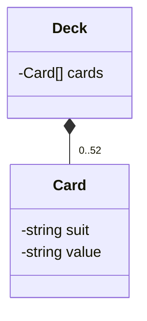

# Five Card Draw Poker Game

## Overview

In this project, you'll apply Object-Oriented Programming (OOP) principles, Test-Driven Development (TDD) methodologies, and work with Git for version control, to implement a Five Card Draw Poker game in Ruby. The project aims to strengthen your understanding of Ruby OOP, RSpec testing, TDD practices, and UML diagramming, through practical application.

## UML Diagram

